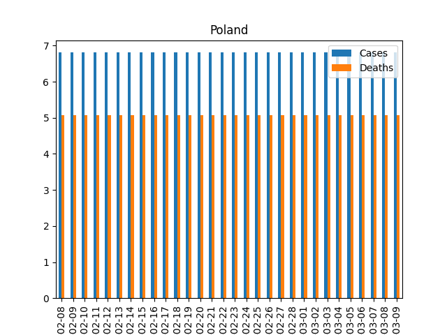

# Covid Plot with Matplotlib and Pandas Libraries

This example provides a demonstration of the use of [Matplotlib](https://matplotlib.org/), a visualization library for Python, combined with [`pandas`](https://pandas.pydata.org/), an open source data analysis and manipulation tool.
The demo shows how to create a standalone executable from this application using GraalPy.
GraalPy comes with a module that can create Python single-file native binaries for Linux, Windows, and macOS.

>**Prerequisites**: A recent version of [CMake](https://cmake.org/) is required to install the Matplotlib package. (For more information, see [Installing CMake](https://cmake.org/install/).)

>Note: GraalPy does not implement the [Tkinter](https://docs.python.org/3/library/tkinter.html) user interface, so some features of matplotlib may not work as expected.

1. [Install GraalPy](https://y-shcheholskyy.github.io/graalpy.github.io/getting-started/) in the **native** configuration (default). Then [create a Virtual Environment](https://y-shcheholskyy.github.io/graalpy.github.io/guides/#creating-a-virtual-environment) and activate it. 
    
    >Consider **Oracle GraalPy** for the best experience. It is licensed under the [GraalVM Free Terms and Conditions (GFTC)](https://www.oracle.com/downloads/licenses/graal-free-license.html) license, which permits use by any user including commercial and production use.

2. Install the `requests`, `pandas`, and `matplotlib` packages (and their dependencies) using `pip`:
    ```bash
    pip install requests
    pip install pandas
    pip install matplotlib
    ```

3. Copy the following contents into a file named _covid\_plot.py_.
(It uses data from the [Open Disease Data API](https://disease.sh/).)

    ```python
    import requests
    import pandas as pd
    import matplotlib.pyplot as plt
    import datetime
    import math
    import sys
    
    # Use an ISO 3-letter country code as listed at https://www.worlddata.info/countrycodes.php
    script_args = sys.argv[1:]
    if len(script_args) == 1:
        country_code = script_args[0]
    else:
        print("Country code '{country_code}' not recognised. Select a country code from https://www.worlddata.info/countrycodes.php".format(country_code=country_code))
        exit
    url = "https://disease.sh/v3/covid-19/historical/{country_code}?lastdays=30".format(country_code=country_code)
    response = requests.get(url)
    if response.status_code != 200:
        print("Failed to retrieve data for {url}: {reason}".format(url=url, reason=response.reason))
        exit()
    response_json = response.json()
    country = response_json["country"]
    timeline = response_json["timeline"]
    # Convert the dates
    dates = list(map(lambda d: datetime.datetime.strptime(d, "%m/%d/%y").strftime("%Y-%m-%d"), timeline["cases"].keys()))
    cases = list(map(lambda c: math.log10(c), timeline["cases"].values()))
    deaths = list(map(lambda d: math.log10(d), timeline["deaths"].values()))
    df = pd.DataFrame(dict(Dates=dates, Cases=cases, Deaths=deaths))
    df.plot(x="Dates", y=["Cases", "Deaths"], kind="bar", title=country)
    filename = "{country}_covid_plot.png".format(country=country)
    print("Writing plot to file: {filename}".format(filename=filename))
    plt.savefig(filename)
    ```

4. Use the following command to run the script, with an example argument:
    ```bash
    graalpy covid_plot.py POL
    ```
    The script creates a file named _Poland\_covid\_plot.png_ with content similar to:
        

    Now continue and create a native executable from this Python application.

5. Unset your `JAVA_HOME` environment variable. 
(For example, on Linux and macOS, use the command `unset JAVA_HOME`.)

6. Create a standalone executable based on your _covid\_plot.py_ script, as shown below.
(For more information about the command-line options, see [Standalone Python Applications](https://y-shcheholskyy.github.io/graalpy.github.io/reference/standalone-applications/).)

    ```bash
    graalpy -m standalone native \
        --module covid_plot.py \
        --output covid_plot \
        --venv <venv-dir>
    ```

7. Run the executable, as follows:
    ```bash
    ./covid_plot
    ```
    You should see the same output as earlier.

### Related Documentation

* [Matplotlib Package](https://matplotlib.org/)
* [Pandas Package](https://pandas.pydata.org/)
* [GraalPy Getting Started](https://y-shcheholskyy.github.io/graalpy.github.io/getting-started/)
* [Standalone Python Applications](https://y-shcheholskyy.github.io/graalpy.github.io/reference/standalone-applications/)
