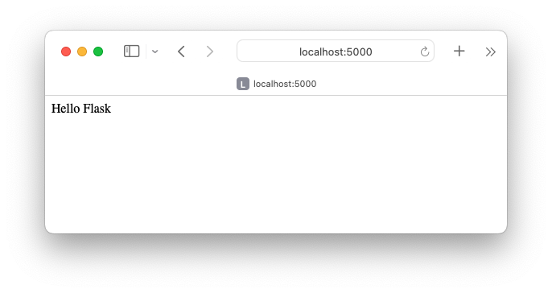

# Python Flask Application

This example provides a demonstration of creating a standalone Python [Flask](https://flask.palletsprojects.com/en/3.0.x/) application, using GraalPy and GraalVM Native Image.

1. [Install GraalPy](https://y-shcheholskyy.github.io/graalpy.github.io/getting-started/) in the **native** configuration. Consider Oracle GraalPy for the best experience. Then [create a Virtual Environment](https://y-shcheholskyy.github.io/graalpy.github.io/guides/#creating-a-virtual-environment) and activate it. 
    
    >Consider **Oracle GraalPy** for the best experience. It is licensed under the [GraalVM Free Terms and Conditions (GFTC)](https://www.oracle.com/downloads/licenses/graal-free-license.html) license, which permits use by any user including commercial and production use.

2. Install the `flask` package (and its dependencies) using `pip`:

    ```bash
    pip install flask
    ```

3. Copy the following contents into a file named _hello\_flask.py_. 
It is adapted from the Flask [Quickstart](https://flask.palletsprojects.com/en/3.0.x/quickstart/) documentation.
    >Note: This code takes a slightly unconventional approach.
    Instead of using Flask's built-in application discovery behavior, the code explicitly calls the `main` function.
    This approach is required by GraalVM Native Image.

    ```python
    from flask import Flask
      
    app = Flask(__name__)
      
    @app.route('/')
    # ‘/’ URL is bound with hello_flask() function.
    def hello_flask():
        return 'Hello Flask'
      
    # main function
    if __name__ == '__main__':
      
        # run() method of Flask class runs the application
        # on the local development server.
        app.run()
    ```

4. Use the following command to run the script:

    ```bash
    graalpy hello_flask.py
    ```
    
    You should see a similar output:
    ```
    * Serving Flask app 'hello_flask'
    * Debug mode: off
    WARNING: This is a development server. Do not use it in a production deployment. Use a production WSGI server instead.
    * Running on http://127.0.0.1:5000
    Press CTRL+C to quit
    ```
    Visit the URL with a web browser, and you should see something like:

    


    Now continue and create a native executable from this Python application, using [GraalVM ahead-of-time Native Image compilation](https://www.graalvm.org/latest/reference-manual/native-image/).

5. Unset your `JAVA_HOME` environment variable. 
(For example, on Linux and macOS, use the command `unset JAVA_HOME`.)

6. Create a native executable based on your _hello\_flask.py_ script, as shown below.
(For more information about the command-line options, see [Standalone Python Applications](https://y-shcheholskyy.github.io/graalpy.github.io/reference/standalone-applications/).)

    ```bash
    graalpy -m standalone native \
        --module hello_flask.py \
        --output hello_flask \
        --venv <venv-dir>
    ```

7. Run the executable, as follows:
    ```bash
    ./hello_flask
    ```
    You should see the same output as earlier.

### Related Documentation

* [Flask](https://flask.palletsprojects.com/en/3.0.x/)
* [GraalPy Getting Started](https://y-shcheholskyy.github.io/graalpy.github.io/getting-started/)
* [Standalone Python Applications](https://y-shcheholskyy.github.io/graalpy.github.io/reference/standalone-applications/)