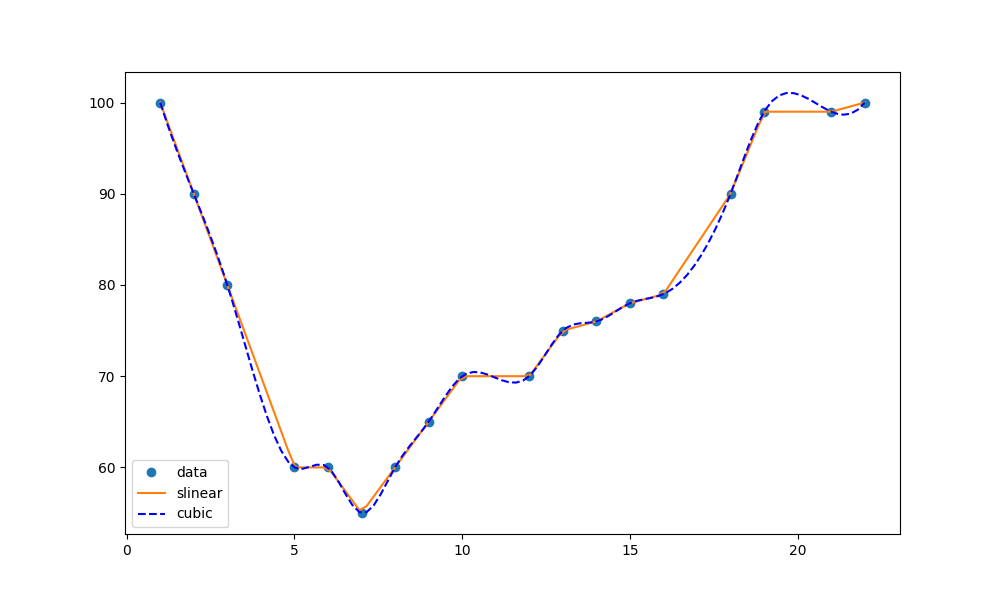

{{ page.description }}

>**Prerequisites**: A recent version of [CMake](https://cmake.org/) is required to install the matplotlib package. (For more information, see [Installing CMake](https://cmake.org/install/).)
> SciPy requires [gfortran](https://gcc.gnu.org/wiki/GFortranBinaries) and [OpenBLAS](https://www.openblas.net/).

>Note: GraalPy does not implement the [Tkinter](https://docs.python.org/3/library/tkinter.html) user interface, so some features of matplotlib may not work as expected.

1. Install `graalpy` and [create a Virtual Environment](/guides/creating_a_virtual_environment/), then activate it. 
(For more information, see [Getting Started](/getting_started/).)

2. Install the `numpy` and `matplotlib` packages (and their dependencies):

    ```bash
    % pip install numpy
    % pip install scipy
    % pip install matplotlib
    ```

3. Copy the following contents into a file named _interpolate.py_.

    ```python
    import numpy as np
    from scipy.interpolate import interp1d 
    import matplotlib.pyplot as plt
    
    x = [1,2,3,5,6,7,8,9,10,12,13,14,15,16,18,19,21,22]
    y = [100,90,80,60,60,55,60,65,70,70,75,76,78,79,90,99,99,100]
    
    x_new = np.linspace(1, 22, 100)
    fun1 = interp1d(x, y, kind = 'slinear') 
    fun2 = interp1d(x, y, kind = 'cubic')
    
    title = "Interpolation"
    plt.title(title)
    plt.figure(figsize=(10,6))
    plt.plot(x, y, 'o', x_new, fun1(x_new), '-', x_new, fun2(x_new), 'b--') 
    plt.legend(['data', 'slinear', 'cubic'], loc = 'best')
    print("Writing plot to file: {filename}".format(filename=title))
    plt.savefig("{filename}.png".format(filename=title))
    ```

4. Use the following command to run the script:

    ```bash
    % graalpy interpolate.py
    ```

5. The script creates a plot as follows:
   

### Related Documentation
* [Creating a Virtual Environment](/guides/creating_a_virtual_environment/)
* [Installing a Package](/guides/installing_a_package/)