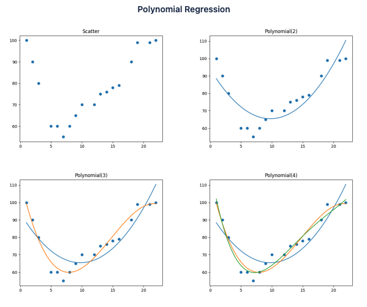

# Polynomial Plot with Matplotlib and NumPy Libraries

This example provides a demonstration of the use of [Matplotlib](https://matplotlib.org/), a visualization library for Python, combined with [NumPy](https://numpy.org/), an open source library of mathematical functions.

>**Prerequisites**: A recent version of [CMake](https://cmake.org/) is required to install the Matplotlib package. (For more information, see [Installing CMake](https://cmake.org/install/).)

>Note: GraalPy does not implement the [Tkinter](https://docs.python.org/3/library/tkinter.html) user interface, so some features of matplotlib may not work as expected.

1. [Install GraalPy](https://y-shcheholskyy.github.io/graalpy.github.io/getting-started/) in the **native** configuration. Consider Oracle GraalPy for the best experience. Then [create a Virtual Environment](https://y-shcheholskyy.github.io/graalpy.github.io/guides/#creating-a-virtual-environment) and activate it. 
    
    >Consider **Oracle GraalPy** for the best experience. It is licensed under the [GraalVM Free Terms and Conditions (GFTC)](https://www.oracle.com/downloads/licenses/graal-free-license.html) license, which permits use by any user including commercial and production use.

2. Install the `numpy` and `matplotlib` packages (and their dependencies) using `pip`:
    ```bash
    pip install numpy
    pip install matplotlib
    ```

3. Copy the following contents into a file named _polynomial.py_.
(It is adapted from [Machine Learning - Polynomial Regression](https://www.w3schools.com/python/python_ml_polynomial_regression.asp).)

    ```python
    import matplotlib.pyplot as plt
    import numpy
    
    
    x = [1,2,3,5,6,7,8,9,10,12,13,14,15,16,18,19,21,22]
    y = [100,90,80,60,60,55,60,65,70,70,75,76,78,79,90,99,99,100]
    
    title = "Scatter"
    plt.title(title)
    plt.scatter(x, y)
    print("Writing plot to file: {filename}".format(filename=title))
    plt.savefig("{filename}.png".format(filename=title))
    
    poly_line = numpy.linspace(1, 22, 100)
    # Create an nth degree polynomial fit
    for n in range(2, 5):
        poly_model = numpy.poly1d(numpy.polyfit(x, y, n))
        plt.plot(poly_line, poly_model(poly_line))
        title = "Polynomial({degree})".format(degree=n)
        plt.title(title)
        print("Writing plot to file: {filename}".format(filename=title))
        plt.savefig("{filename}.png".format(filename=title))
    ```

4. Use the following command to run the script:
    ```bash
    graalpy polynomial.py
    ```
    The script creates several files as follows:
    
    

### Related Documentation

* [Matplotlib](https://matplotlib.org/)
* [NumPy](https://numpy.org/)
* [GraalPy Getting Started](https://y-shcheholskyy.github.io/graalpy.github.io/getting-started/)
* [Standalone Python Applications](https://y-shcheholskyy.github.io/graalpy.github.io/reference/standalone-applications/)