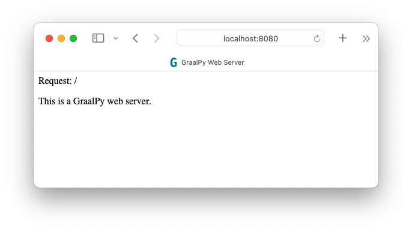

# HTTP Server Application

This example provides a demonstration of creating a standalone web server based on the Python [`http.server`](https://docs.python.org/3/library/http.server.html) module, using GraalPy and GraalVM Native Image. 

1. [Install GraalPy](https://y-shcheholskyy.github.io/graalpy.github.io/getting-started/) in the **native** configuration. Consider Oracle GraalPy for the best experience. Then [create a Virtual Environment](https://y-shcheholskyy.github.io/graalpy.github.io/guides/#creating-a-virtual-environment) and activate it. 
    
    >Consider **Oracle GraalPy** for the best experience. It is licensed under the [GraalVM Free Terms and Conditions (GFTC)](https://www.oracle.com/downloads/licenses/graal-free-license.html) license, which permits use by any user including commercial and production use.

2. Copy the following contents into a file named _webserver.py_:

    ```python
    from http.server import BaseHTTPRequestHandler, HTTPServer
    
    host_name = "localhost"
    server_port = 8080
    
    class MyServer(BaseHTTPRequestHandler):
        def do_GET(self):
            self.send_response(200)
            self.send_header("Content-type", "text/html")
            self.end_headers()
            self.wfile.write(bytes("<html><head><title>GraalPy Web Server</title></head>", "utf-8"))
            self.wfile.write(bytes("<body>", "utf-8"))
            self.wfile.write(bytes("<p>Request: %s</p>" % self.path, "utf-8"))
            self.wfile.write(bytes("<p>This is a GraalPy web server.</p>", "utf-8"))
            self.wfile.write(bytes("</body></html>", "utf-8"))
    
    if __name__ == "__main__":       
        web_server = HTTPServer((host_name, server_port), MyServer)
        print("Server started http://%s:%s" % (host_name, server_port))
    
        try:
            web_server.serve_forever()
        except KeyboardInterrupt:
            pass
    
        web_server.server_close()
        print("Server stopped.")
    ```

3. Use the following command to run the script:
    ```bash
    graalpy webserver.py
    ```
    The server is started on localhost port 8080:
    ```
    Server started http://localhost:8080
    ```
    Visit the URL with a web browser, and you should see something like:
    
    

    Now continue and create a native executable from this Python application, using [GraalVM ahead-of-time Native Image compilation](https://www.graalvm.org/latest/reference-manual/native-image/).

4. Unset your `JAVA_HOME` environment variable. 
(For example, on Linux and macOS, use the command `unset JAVA_HOME`.)

5. Create a native executable based on your _webserver.py_ script, as shown below.
(For more information about the command-line options, see [Standalone Python Applications](/reference/standalone-applications/).)

    ```bash
    graalpy -m standalone native \
        --module webserver.py \
        --output webserver \
        --venv <venv-dir>
    ```

8. Run the executable, as follows:
    ```bash
    ./webserver
    ```
    You should see the same output as earlier.

### Related Documentation

* [Python HTTP server](https://docs.python.org/3/library/http.server.html)
* [GraalPy Getting Started](https://y-shcheholskyy.github.io/graalpy.github.io/getting-started/)
* [Standalone Python Applications](https://y-shcheholskyy.github.io/graalpy.github.io/reference/standalone-applications/)