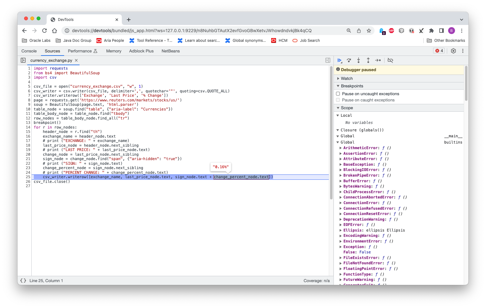

## Debugging a Python Application

GraalPy supports the standard Python debugger `pdb`.
Refer to the official [PDB documentation](https://docs.python.org/3/library/pdb.html) for usage.
The built-in `breakpoint()` function uses `pdb` by default.

To enable the debugger, pass the `--inspect` command-line option.
You can inspect variables, set watch expressions, interactively evaluate code snippets, and so on.

1. [Create a demo application](Creating_a_Python_Application.md).

2. To start debugging, insert a `breakpoint()` function at line 13 in the application file _currency\_exchange.py_ before the `for` loop:

    ```python
    import requests
    from bs4 import BeautifulSoup
    import csv
        
    csv_file = open("currency_exchange.csv", "w", 1)
    csv_writer = csv.writer(csv_file, delimiter=',', quotechar='"', quoting=csv.QUOTE_ALL)
    csv_writer.writerow(['Exchange', 'Last Price', '% Change'])
    page = requests.get('https://www.reuters.com/markets/stocks/us/')
    soup = BeautifulSoup(page.text, 'html.parser')
    table_node = soup.find("table", {"aria-label": "Currencies"})
    table_body_node = table_node.find("tbody")
    row_nodes = table_body_node.find_all("tr")
    breakpoint()
    for r in row_nodes:
        header_node = r.find("th")
        exchange_name = header_node.text
        last_price_node = header_node.next_sibling
        last_price = last_price_node.text
        change_node = last_price_node.next_sibling
        sign_node = change_node.find("span", {"aria-hidden": "true"})
        change_percent_node = sign_node.next_sibling
        csv_writer.writerow([exchange_name, last_price, sign_node.text + change_percent_node.text])
    csv_file.close()
    ```

3. Run the script using the command-line option `--inspect`:
    ```bash
    graalpy --inspect currency_exchange.py
    ``` 
    You should see output similar to:
    ```bash
    Debugger listening on ws://127.0.0.1:9229/VrhCaY7wR5tIqy2zLsdFr3f7ixY3QB6kVQ0S54_SOMo
    For help, see: https://www.graalvm.org/tools/chrome-debugger
    E.g. in Chrome open: devtools://devtools/bundled/js_app.html?ws=127.0.0.1:9229/VrhCaY7wR5tIqy2zLsdFr3f7ixY3QB6kVQ0S54_SOMo
    ```

4. Open your Chrome browser and enter the URL provided. 
Now you can inspect the stack, variables, evaluate variables, and selected expressions in a tooltip, and so on. For example: 
    
